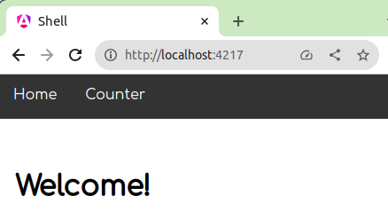
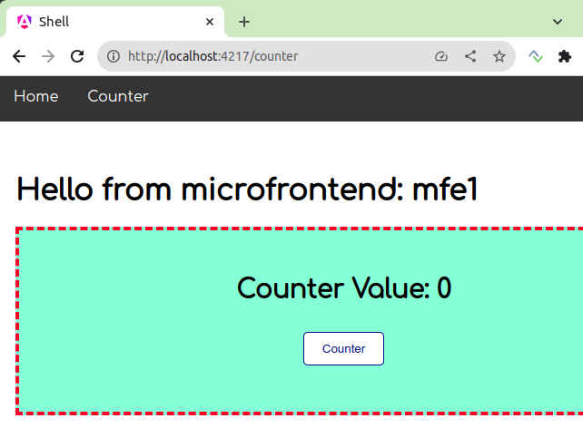
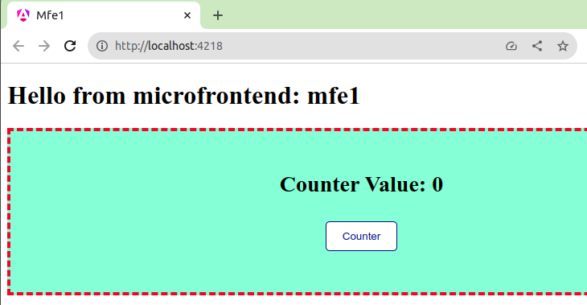

# Micro Frontend - Angular and Native Federation

This project was inspired but other projects (see references) to have two applications: host and remote.
- The host application, shell, hosts the micro-frontend counter.
- The remote application, mfe1, has a web component counter.

The angular extension native federation will create what is needed to communicate both applications.

The applications were created with angular17.

- shell application
  - 
  - 
- micro-frontend counter
  - 

## References
[Micro Frontends with Modern Angular – Part 1: Standalone and esbuild](https://www.angulararchitects.io/en/blog/micro-frontends-with-modern-angular-part-1-standalone-and-esbuild/)

